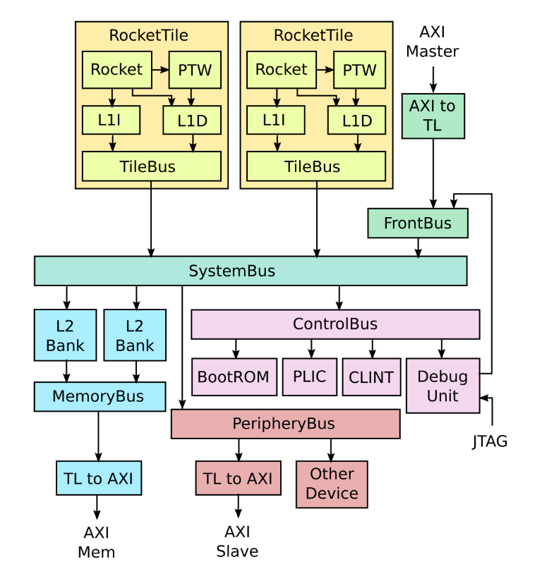
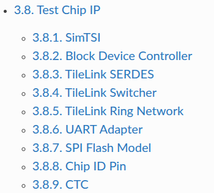
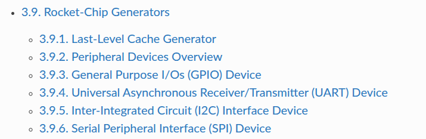
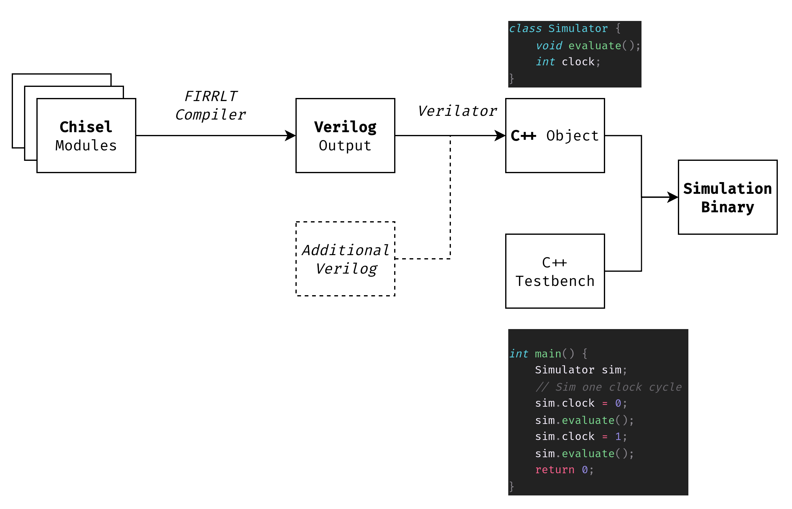

# BOOM Development Cheatsheet

This guide is a collection of notes taken during previous projects on BOOM.

Its intended audience is Master/PhD students of VuSec that want to either (1)
build a fuzzing harness (then you're interested in the build system) or (2) implement
some special kind of security feature on the core, test that it works in simulation
and benchmark its overhead.

It is **not** intended to give a complete background on hardware design, Chisel,
Verilog or physical implementation (maybe we'll get there at some point).

## BOOM Documentation

BOOM is an open-source core with an out-of-order pipeline and speculation
mechanisms developed at Berkeley. It's written in Chisel.

Useful links:

- Source code: https://github.com/riscv-boom/riscv-boom
  - In particular, the Chisel code is here: https://github.com/riscv-boom/riscv-boom/tree/master/src/main/scala
- Pipeline documentation: https://docs.boom-core.org/en/latest/sections/intro-overview/boom-pipeline.html


- Hardware components overview (Taken from RocketChip, but basically you can swap "Rocket" with "BOOM").
  - "TileLink" (TL) is the internal, high-speed bus to interconnect cores ("tiles")
  - "AXI" (Advanced Crossbar Interface or something like that) are external buses, e.g. where peripherals and DRAM are connected



## Chipyard: BOOM's build system

A CPU is much more than just the core -- think CSRs, peripherals, bus interfaces
to memory, a Boot ROM, a debug interface, and many other components.

To orchestrate these systems in a modular way, Berkeley chips use Chipyard: https://chipyard.readthedocs.io/.

### Quickstart

Something like this should work out-of-the box:

```bash
# Download the template and setup environment
git clone https://github.com/ucb-bar/chipyard.git
cd chipyard
./scripts/init-submodules-no-riscv-tools.sh

# build the sofware toolchain
./scripts/build-toolchains.sh riscv-tools

# add RISCV to env, update PATH and LD_LIBRARY_PATH env vars
# note: env.sh generated by build-toolchains.sh
source env.sh

# generate a simulation for LargeBOOMConfig
cd sims/verilator
make CONFIG=LargeBoomConfig
```

If this ends without errors, the `sims/verilator` folder should now contain:

- a `generated-src` folder that contains
  - verilog sources, generated from Chisel
  - C++ sources, generated by Verilator
- new binary called something like `simulator-chipyard.harness-LargeBoomConfig` that runs a cycle-accurate simulation of the selected config (more on how to run [here](https://chipyard.readthedocs.io/en/latest/Simulation/Software-RTL-Simulation.html#custom-benchmarks-tests))

### Available Components

This page describes all components available in Chipyard: https://chipyard.readthedocs.io/en/latest/Chipyard-Basics/Chipyard-Components.html

It's not important to understand all of them for now -- you can use this list later when you dig into the code. The relevant ones for us are:

- Hardware
  - `BOOM`: the core we're using
  - `Rocket Chip`: an older, in-order core. Its codebase contains stuff that was later reused for BOOM, e.g. L1 Caches
  - `testchipip`: contains system components (e.g. UART, SPI, JTAG, I2C, PWM) and testing infra
    <!--  -->
  - `rocket-chip generators`: other shared components (e.g. caches)
    <!--  -->
- Software
  - `riscv-tools`: bunch of utils, most interestingly
    - RISCV Compiler & Assembler, now mostly mainline in GCC/LLVM
    - bootloader & proxy kernel, used to run bare-metal programs without booting up a full Linux Kernel
    - ISA simulator (Spike), a software implementation of what each instruction should do
  - `verilator` a cycle-accurate simulator that "runs" your hardware completely in software (more about this later)

## What does it mean to "build" a hardware project?

This section tries to describe what happens under the hood when you run

```bash
cd sims/verilator
make CONFIG=LargeBoomV3Config
```

Modern hardware is typically developed writing _code_. There
are particular programming languages for this, called HDLs (hardware description
languages):

- VHDL, Verilog and SystemVerilog are considered "low-level" HDLs (~like C for
  programming)
- Chisel is considered a higher-level HDL (~like Java)

Chipyard's workflow looks something like this:

1. Hardware components are written in Chisel
1. `config` fragments define which components to use in a given design and how to connect them together
   - The "top" component (called `DigitalTop` in Chipyard) is like a "main" function in C
1. Chisel is transpiled to Verilog via the FIRRTL compiler
   - **FYI:** You can actually have some components written in "raw" Verilog (Verilog Black-Boxing https://chipyard.readthedocs.io/en/latest/Customization/Incorporating-Verilog-Blocks.html)
   - **FYI:** In Verilog itself, you can also have modules that are defined in Verilog but implemented in C (something similar to `extern C` in C++). This mechanism is called `DPI-C`, and of course only works in software simulations.
1. Once you have the Verilog source, you can either:
   - _synthesize_ to an FPGA
     - This generates a _bitstream_ that you need to flash on your FPGA
     - Note that this is several orders of magnitude faster than software simulation
   - build a _software simulation_ using Verilator (a process called "Verilation")

## Testing with Verilator

Verilator basically transforms your Verilog code into a C++ object where each member represents a wire in the design (more or less) and a public `eval()` function is exposed to drive the simulation with the current inputs.

This requires also to write a software component with a `main()` function (called a "simulation driver" or a "testbench") that drives the simulation, i.e. literally sets the clock to `1`, calls `eval()`, sets the clock to `0` and calls `eval()` again.

Once you have (1) you simulation driver and (2) the verilated C++ code, Verilator can compile everything into a binary that you can run on your machine -- no additional hardware needed!



### Running a RISC-V Program on Verilator

The Chipyard docs contain a quick guide on:

- How to run the default example https://chipyard.readthedocs.io/en/latest/Simulation/Software-RTL-Simulation.html#simulating-the-default-example

  ```bash
  ./simulator-chipyard.harness-LargeBoomV3Config $RISCV/riscv64-unknown-elf/share/riscv-tests/isa/rv64ui-p-simple
  ```

- How to run a custom test program https://chipyard.readthedocs.io/en/latest/Simulation/Software-RTL-Simulation.html#custom-benchmarks-tests

  ```bash
  # Enter Tests directory
  cd tests
  make

  # Enter Verilator or VCS directory
  cd ../sims/verilator
  make run-binary BINARY=../../tests/hello.riscv
  ```

  - When using verilator you can use this to skip quite a lot of useless cycles https://chipyard.readthedocs.io/en/latest/Simulation/Software-RTL-Simulation.html#fast-memory-loading
    ```bash
    make run-binary BINARY=test.riscv LOADMEM=1
    ```

- More info on how these programs are built in a way that "just works" for the simulator https://chipyard.readthedocs.io/en/latest/Software/Baremetal.html
  - Basically programs are compiled with the libgloss-htif library that enables writing programs with simple syscalls (like `printf`) and running them without the need of a fully booted OS

More info on what happens under the hood can be found in the corresponding deep dive of this guide.

## Testing on FPGA

// TODO

## Deep Dives

You can check the "deep dive" documents for more info on specific parts:

- [Build System Deep Dive](build-system-deep-dive.md) describes in detail what happens on `make CONFIG=LargeBoomConfig` and when you run a binary
- [Design Deep Dive](design-deep-dive.md) contains a collection of notes of various parts of the BOOM design
