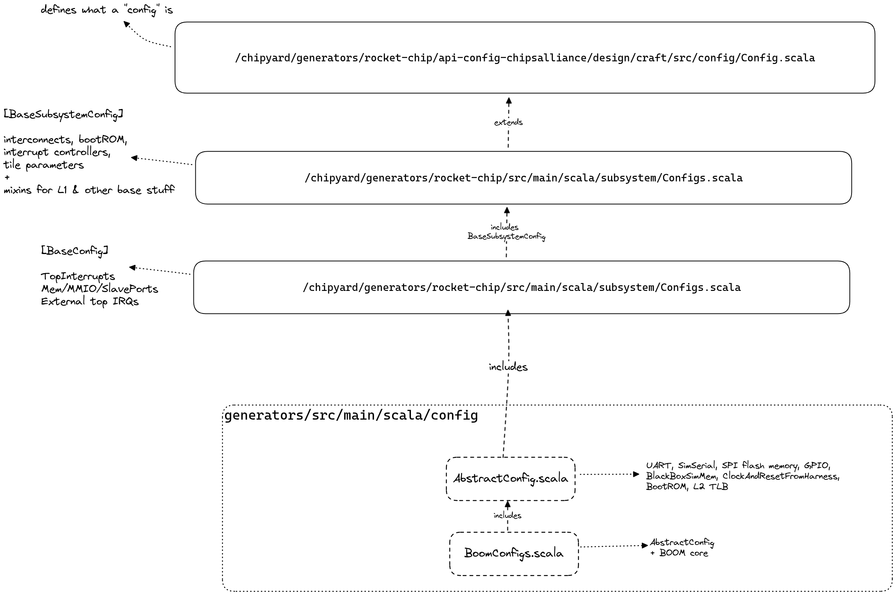
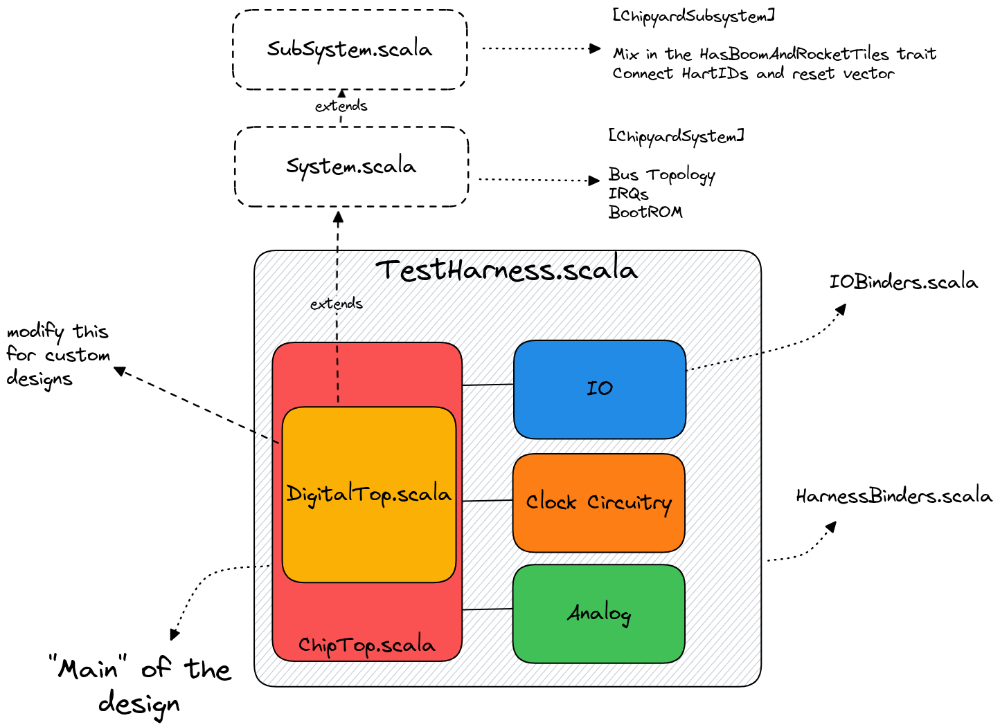
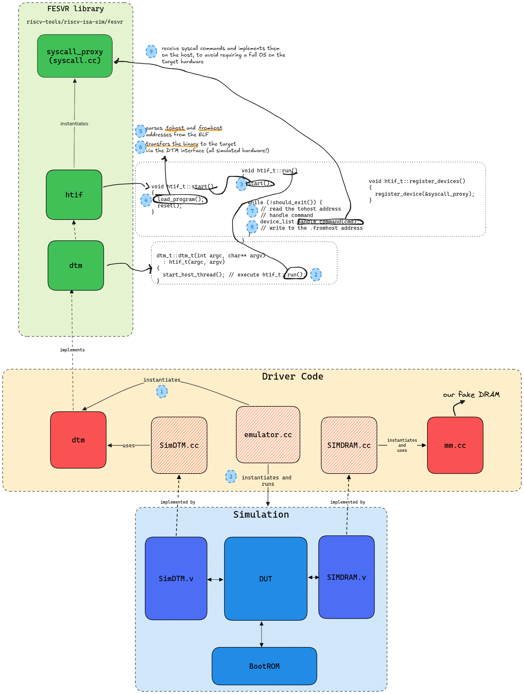
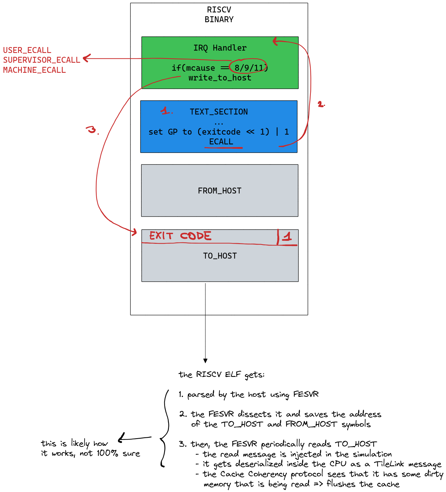

# Build System Deep Dive

Additional stuff I discovered during long nights of staring at the codebase.

## Chipyard Configs -- Deep Dive

As we said, the build system uses `config`s to let the user define which hardware components to use and how to connect them. Configs are divided into different "fragments" scattered around the codebase. Let's look at the ones used for BOOM:



- We start from `BoomConfigs.scala` (in the [chipyard repo](https://github.com/ucb-bar/chipyard/blob/main/generators/chipyard/src/main/scala/config/BoomConfigs.scala))

  ```java
  class LargeBoomV3Config extends Config(
    new boom.v3.common.WithNLargeBooms(1) ++
    new chipyard.config.WithSystemBusWidth(128) ++
    new chipyard.config.AbstractConfig)
  ```

  - **NOTE** Configs are applied bottom to top

- `AbstractConfig` is defined [here](https://github.com/ucb-bar/chipyard/blob/main/generators/chipyard/src/main/scala/config/AbstractConfig.scala) and makes sure that all the off-core components are included in the design (e.g. BootROM, SystemBus, Periphery Bus, Memory Bus, inclusive caches, IO Cells, peripherals etc ). It instantiates also the `TestHarness` part of the chip, which is only used when testing the device. Here's an overview (most parts are omitted since the config is quite big)

  ```java
  class AbstractConfig extends Config(
      new chipyard.harness.WithUARTAdapter ++   // Fake UART module that prints values to stdio
      new chipyard.harness.WithBlackBoxSimMem ++  // Fake DRAM that simulates loading and storing
      new chipyard.harness.WithSimTSIOverSerialTL ++ // "Tethered Serial Interface"
      new chipyard.harness.WithClockFromHarness ++  // clock controlled by harness
      new chipyard.harness.WithResetFromHarness ++  // reset controlled by harness
      new chipyard.config.WithBootROM ++  // use default bootrom
      new testchipip.boot.WithBootAddrReg ++   // add a boot-addr-reg for configurable boot address
      new freechips.rocketchip.subsystem.WithNExtTopInterrupts(0) ++    // external interrupts
      new testchipip.soc.WithMbusScratchpad(base = 0x08000000,     // add 64 KiB on-chip scratchpad
                                              size = 64 * 1024) ++

      // ** omitted **

      new freechips.rocketchip.system.BaseConfig
  )
  ```

  - `freechips.rocketchip.system.BaseConfig` can be found [here](https://github.com/chipsalliance/rocket-chip/blob/8f1e33b253e3bce741861c0a2e3ba8b7ff85b292/src/main/scala/system/Configs.scala)
    ```java
    class BaseConfig extends Config(
      new WithDefaultMemPort ++
      new WithDefaultMMIOPort ++
      new WithDefaultSlavePort ++
      new WithTimebase(BigInt(1000000)) ++ // 1 MHz
      new WithDTS("freechips,rocketchip-unknown", Nil) ++
      new WithNExtTopInterrupts(2) ++
      new BaseSubsystemConfig
    )
    ```
  - `BaseSubsystemConfig` can be found [here](https://github.com/chipsalliance/rocket-chip/blob/8f1e33b253e3bce741861c0a2e3ba8b7ff85b292/src/main/scala/subsystem/Configs.scala)

    ```java
    class BaseSubsystemConfig extends Config ((site, here, up) => {
      case BootROMLocated(InSubsystem) => Seq(BootROMParams(contentFileName = SystemFileName("./bootrom/bootrom.img")))
      // ** other configs omitted **
    })

    ```

  - Note that the BootROM contents can be found here https://github.com/ucb-bar/testchipip/blob/5dca05bef9a9d7b135e18543379bc782df80ce40/src/main/resources/testchipip/bootrom/bootrom.S

- `WithNLargeBooms` is defined in the [boom repo](https://github.com/riscv-boom/riscv-boom/blob/master/src/main/scala/v3/common/config-mixins.scala). Note that anything starting with "With" is called a _config mixin_, and be defined in either the BOOM repo or the RocketChip repo (or any other generator repo for that matter).

  ```java
  class WithNLargeBooms(n: Int = 1) extends Config(
    new WithTAGELBPD ++ // Default to TAGE-L BPD
    new Config((site, here, up) => {
      case TilesLocated(InSubsystem) => {
        val prev = up(TilesLocated(InSubsystem), site)
        val idOffset = up(NumTiles)
        (0 until n).map { i =>
          BoomTileAttachParams(
            tileParams = BoomTileParams(
              core = BoomCoreParams(
                fetchWidth = 8,
                decodeWidth = 3,
                numRobEntries = 96,
                issueParams = Seq(
                  IssueParams(issueWidth=1, numEntries=16, iqType=IQT_MEM.litValue, dispatchWidth=3),
                  IssueParams(issueWidth=3, numEntries=32, iqType=IQT_INT.litValue, dispatchWidth=3),
                  IssueParams(issueWidth=1, numEntries=24, iqType=IQT_FP.litValue , dispatchWidth=3)),
                numIntPhysRegisters = 100,
                numFpPhysRegisters = 96,
                numLdqEntries = 24,
                numStqEntries = 24,
                maxBrCount = 16,
                numFetchBufferEntries = 24,
                ftq = FtqParameters(nEntries=32),
                fpu = Some(freechips.rocketchip.tile.FPUParams(sfmaLatency=4, dfmaLatency=4, divSqrt=true))
              ),
              dcache = Some(
                DCacheParams(rowBits = 128, nSets=64, nWays=8, nMSHRs=4, nTLBWays=16)
              ),
              icache = Some(
                ICacheParams(rowBits = 128, nSets=64, nWays=8, fetchBytes=4*4)
              ),
              tileId = i + idOffset
            ),
            crossingParams = RocketCrossingParams()
          )
        } ++ prev
      }
      case NumTiles => up(NumTiles) + n
    })
  )
  ```

## Building the Verilated Simulation -- Deep Dive

Our quick start suggested to run `make CONFIG=LargeBoomV3Config`.

The complete list of makefile variables can be found here: https://chipyard.readthedocs.io/en/latest/Simulation/Software-RTL-Simulation.html#makefile-variables-and-commands.

The default values for these variables can be found in the chipyard repo, in `variables.mk`:

```
	SBT_PROJECT       ?= chipyard
	MODEL             ?= TestHarness
	VLOG_MODEL        ?= $(MODEL)
	MODEL_PACKAGE     ?= chipyard.harness
	CONFIG            ?= RocketConfig
	CONFIG_PACKAGE    ?= $(SBT_PROJECT)
	GENERATOR_PACKAGE ?= $(SBT_PROJECT)
	TB                ?= TestDriver
	TOP               ?= ChipTop
```

### Chisel to Verilog

The Chisel → Verilog step is defined in `common.mk` (target named `verilog`).
This step basically does the following:

- Instantiates `TestHarness`, which is defined as the "MODEL" in the Makefile
- **TestHarness** instantiates **ChipTop**
- ChipTop instantiates **DigitalTop**
  - DigitalTop inherits from System
  - System inherits from SubSystem

All of these instantiations take into account what is defined in the selected config.



The result will be a big Verilog file containing TestHarness as its "top".

### Verilog → C++ → Binary

The "Verilation" step is the act of using Verilator to transform the Verilog source
into a C++ object.

- verilator is invoked in `sims/verilator/makefile`
  - This will generate _a lot_ of files. `VTestHarness.h` will contain the simulation object used by the testbench
  - Together with _generating_ C code that represents the verilog source, verilator also transfers a bunch of C++ sources that implement Verilog modules used only during simulation (see previous comment on DPI-C)
- The default C++ simulation driver can be found in https://github.com/chipsalliance/rocket-chip/blob/8f1e33b253e3bce741861c0a2e3ba8b7ff85b292/src/main/resources/csrc/emulator.cc
- Finally, Verilator generates a `VTestHarness.mk` which is invoked to compile TestHarness + DPI-C code + simulation driver into a single binary

The name of the output binary is defined in `sims/verilator/Makefile` as

```
sim_prefix = simulator
sim = $(sim_dir)/$(sim_prefix)-$(MODEL_PACKAGE)-$(CONFIG)
```

Which in our case will results in

```
sims/verilator/simulator-chipyard.harness-LargeBoomConfig
```

## Running RISC-V Programs -- Deep Dive

The default testbench that gets compiled when you `make CONFIG=LargeBoomV3Config` reads a RISC-V ELF binary, whose path is provided to the command line, and "runs" it. But actually, there's a lot going on under the hood.

Starting from RocketChip's `emulator.cc` (which can be found [here](https://github.com/chipsalliance/rocket-chip/blob/8f1e33b253e3bce741861c0a2e3ba8b7ff85b292/src/main/resources/csrc/emulator.cc))

1. Command-line args are parsed and used to initialize the DTM module

```C++
dtm = new dtm_t(htif_argc, htif_argv);
```

2. Simulation object is built an initialized

```C++
TEST_HARNESS *tile = new TEST_HARNESS
```

3. A success signal is waited for, either from the DTM module or the hardware itself (see `TestDriver.v`).

```C++
  while (trace_count < max_cycles) {
    if (done_reset && (dtm->done() || jtag->done() || tile->io_success))
      break;
```

But what does this DTM module do?

### DTM Module

The Debug Transfer Module (DTM) is

- initialized in `emulator.cc`
- defined in C inside of the FESVR (Front-End Server) code, which resides in the [riscv-isa-sim](https://github.com/riscv-software-src/riscv-isa-sim/blob/9c190a07c6838f6392bafa4ad83acea462c7f759/fesvr/dtm.h) code
- used in [`SimDTM.v`](https://github.com/chipsalliance/rocket-chip/blob/8f1e33b253e3bce741861c0a2e3ba8b7ff85b292/src/main/resources/vsrc/SimDTM.v), a "black-box" component of `rocket-chip` that is implemented in C ([SimDTM.cc](https://github.com/chipsalliance/rocket-chip/blob/8f1e33b253e3bce741861c0a2e3ba8b7ff85b292/src/main/resources/csrc/SimDTM.cc))
  - this is connected to the ChipTop by chipyard's [`HarnessBinders`](chipyard/src/main/scala/HarnessBinders.scala)

This hardware component basically implements the communication between the "outside world" (host) and the simulated design (target).

Communication between these two worlds follows the HTIF protocol (Berkeley Host-Target Interface).

### HTIF Protocol

This is what devs have to say of the HTIF protocol:

> The HTIF is the Host/Target Interface, which has the front-end server (riscv-fesvr, running on your host computer) communicating with the target design (Sodor). The riscv-fesvr loads the binary into the Target memory via the HTIF mem ports, and then uses the Control/Status Registers to bring the core out of reset. Once the program is finished, the Target tells the riscv-fesvr it is finished via the tohost CSR and simulation ends.
>
> HTIF is a non-standard tool for Berkeley processors, so there's no documentation on it. It is going to disappear soon, as the RISC-V platform spec is released and the cores are updated to be self-hosting.

Basically the HTIF protocol defines that the communication between host and guest can be done using two memory regions:

- a `.fromhost` memory region that contains data coming from the outside world
- a `.tohost` memory region where data is sent to the driver

Most notably, TOHOST commands are:

- end of simulation, contains a return code
- request that a syscall is performed on the host (e.g. printf)



In the binaries we build with chipyard is all handled by "libgloss", so that you can write "printf" in your C program, compile it with libgloss, and as a result the program will:

- write a specific code to the `.tohost` region
- wait that the `.fromhost` region contains the result
- in the meantime, on the host, the `.tohost` region is continuously probed for commands
  - when the `printf` command is seen, the host executes a `printf`



# Future Work

While most projects don't really require this level of in-depth information,
it was useful for me to remove a bunch of stuff when building the simulation,
to make fuzzing _much_ faster.

In general, the Phantom Trails repo contains a deeply debloated version of
this build system that we might want to Dockerize and maybe give to students
at some point?
