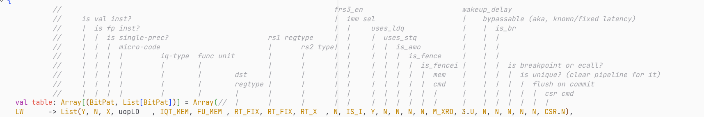

# Design Deep Dive

Various notes about parts of the codebase, we could restructure them a bit.

## Predictors

BOOM uses a TAGE (tournament) predictor that contains multiple predictors chained
one after the other, and can choose to prioritize one or another by observing
their predictions and then seeing from the misprediction signal if someone
was correct.

Here you can see how they are connected.

```scala
/**
*  Branch prediction configs below
*/

class WithTAGELBPD extends Config((site, here, up) => {
case TilesLocated(InSubsystem) => up(TilesLocated(InSubsystem), site) map {
    case tp: BoomTileAttachParams => tp.copy(tileParams = tp.tileParams.copy(core = tp.tileParams.core.copy(
    bpdMaxMetaLength = 120,
    globalHistoryLength = 64,
    localHistoryLength = 1,
    localHistoryNSets = 0,
    branchPredictor = ((resp_in: BranchPredictionBankResponse, p: Parameters) => {
        val loop = Module(new LoopBranchPredictorBank()(p))
        val tage = Module(new TageBranchPredictorBank()(p))
        val btb = Module(new BTBBranchPredictorBank()(p))
        val bim = Module(new BIMBranchPredictorBank()(p))
        val ubtb = Module(new FAMicroBTBBranchPredictorBank()(p))
        val preds = Seq(loop, tage, btb, ubtb, bim)
        preds.map(_.io := DontCare)

        ubtb.io.resp_in(0)  := resp_in
        bim.io.resp_in(0)   := ubtb.io.resp
        btb.io.resp_in(0)   := bim.io.resp
        tage.io.resp_in(0)  := btb.io.resp
        loop.io.resp_in(0)  := tage.io.resp

        (preds, loop.io.resp)
    })
    )))
    case other => other
}
})
```

## LSQ

// TODO: some interesting stuff about LSQ, maybe students can do writeups about this

## PNR

> 3.10.5 Point of No Return (PNR)
>
> The point-of-no-return head runs ahead of the ROB commit head, marking the next instruction which might be misspeculated or generate an exception. These include unresolved branches and untranslated memory operations. Thus,
> the instructions ahead of the commit head and behind the PNR head are guaranteed to be non-speculative, even if they
> have not yet written back

rob.scala:704

```scala
val **unsafe_entry_in_rob** = **rob_unsafe_masked**.reduce(_||_)
    val next_rob_pnr_idx = Mux(unsafe_entry_in_rob,
                               AgePriorityEncoder(rob_unsafe_masked, rob_head_idx),
                               rob_tail << log2Ceil(coreWidth) | PriorityEncoder(~rob_tail_vals.asUInt))
```

rob.scala:490

```c
**rob_unsafe_masked**((i << log2Ceil(coreWidth)) + w) := **rob_val**(i) && (**rob_unsafe**(i) || **rob_exception**(i))
```

rob.scala:325

```scala
rob_bsy(rob_tail)       := !(io.enq_uops(w).is_fence ||
                                   io.enq_uops(w).is_fencei)
**rob_unsafe**(rob_tail)    := io.enq_uops(w).**unsafe**
rob_uop(rob_tail)       := io.enq_uops(w)
**rob_exception**(rob_tail) := io.enq_uops(w).**exception**
```

## Decoder

Cheatsheet of what info are extracted at decode time.



## Virtual Memory

// TODO, maybe describe the minimal setup we had for PhantomTrails?
